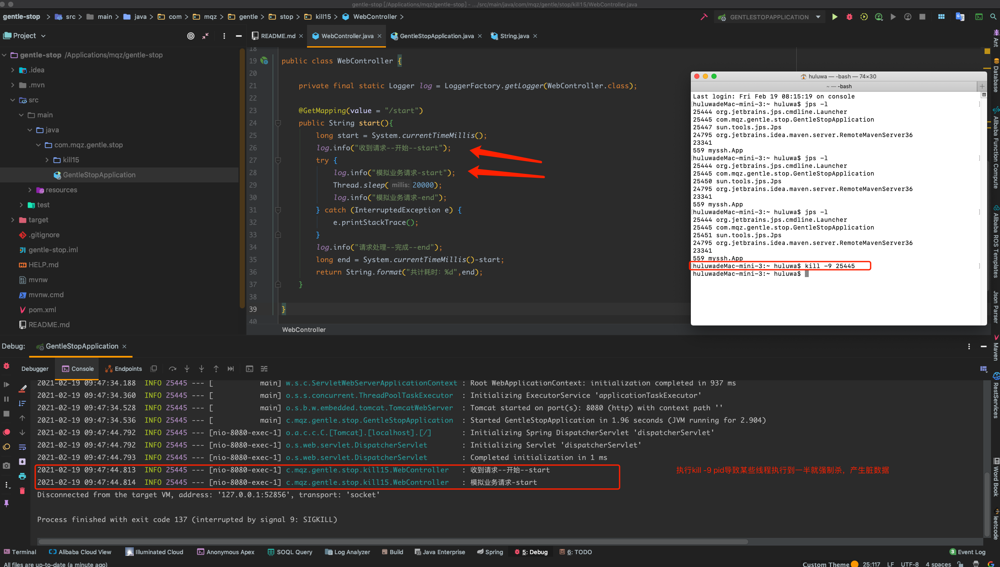
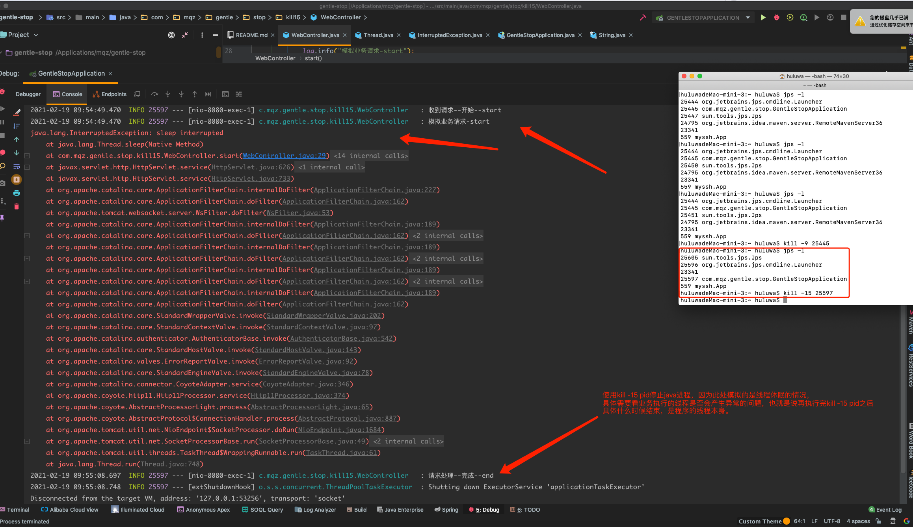
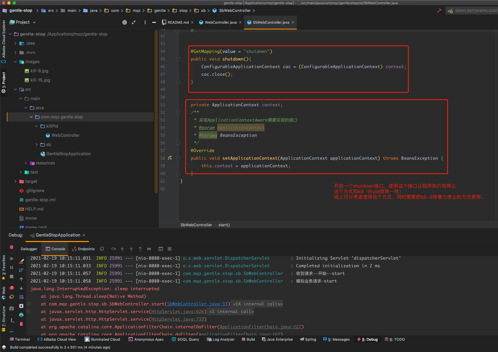
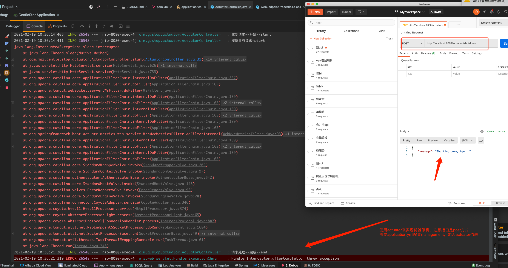
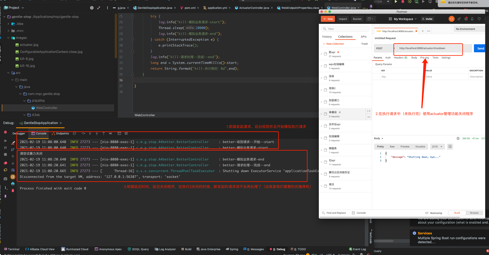
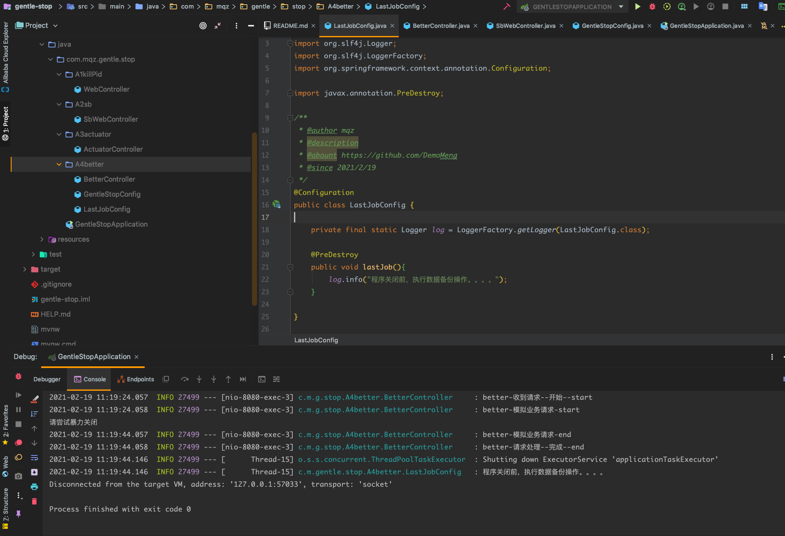

# 优雅停机替换kill -9
- kill -9 pid 带来的问题

* kill -9 属于暴力删除，
  * 举个栗子：转账功能，再给两个账户进行加钱扣钱的时候突然断电了？这个时候会发生什么事情？对于InnoDB存储引擎来说，没有什么损失，因为它支持事务，
    但是对于MyISAM引擎来说那简直就是灾难，为什么？假如给A账户扣了钱，现在需要将B账户加钱，这个时候停电了，就会造成，A的钱被扣了，但是B没有拿到这笔钱，这在生产环境是绝对不允许的。
  * kill -9 相当于突然断电的效果。
  * 当然了，像转账这种，肯定不是使用MyISAM引擎，但是如今分布式火了起来，跨服务转账已经是很平常的事情，这种时候如果使用kill -9 去停止服务，那就不是你的事务能保证数据的准确性了，
  * 这个时候你可能会想到分布式事务，这个世界上没有绝对的安全系统或者架构，分布式事务也是一样，他也会存在问题，概率很小，如果一旦发生，损失有可能是无法弥补的，
  * 所以一定不能使用kill -9 去停止服务，因为你不知道他会造成什么后果。
  * 在MyISAM引擎中表现的更明显，比如用户的信息由两张表维护，管理员修改用户信息的时候需要修改两张表，但由于你的kill -9 暴力结束项目，导致只修改成功了一张表，这也会导致数据的不一致性，这是小事，
  * 因为大不了再修改一次，但是金钱、合同这些重要的信息如果由于你的暴力删除导致错乱，我觉得可能比删库跑路还严重，至少删库还能恢复，你这个都不知道错在哪里。`

* 其实java给我们提供了结束项目的功能，比如：tomcat可以使用shutdown.bat/shutdown.sh进行优雅结束。`

* 第一步：停止接收请求和内部线程。
* 第二步：判断是否有线程正在执行。
* 第三步：等待正在执行的线程执行完毕。
* 第四步：停止容器。

- 优雅停机的方式

* 1.kill -15 pid
    * 写一个controller接口，然后打印：test — start之后让让程序休眠100秒，然后再打印：test — end，在线程休眠中我们使用kill -15 pid来结束这个进程，你们猜 test — end会被打印吗？
    * 但是test — end是打印出来了，为什么会报错呢？这就和sleep这个方法有关了，在线程休眠期间，当调用线程的interrupt方法的时候会导致sleep抛出异常，
    * 这里很明显就是kill -15 这个命令会让程序马上调用线程的interrupt方法，目的是为了让线程停止，虽然让线程停止，但线程什么时候停止还是线程自己说的算，这就是为什么我们还能看到：test — end的原因。

* 2.ConfigurableApplicationContext.close，springboot提供的程序关闭方式。该方式和kill -15 pid差不多
    * ConfigurableApplicationContext.close方法中程序在启动的时候向jvm注册了一个关闭钩子，我们在执行colse方法的时候会删除这个关闭钩子，jvm就会知道这是需要停止服务。

* 3.actuator
    * 加入actuator依赖，并且配置application.yml中的management配置，在模拟请求localhost:8080/actuator/start接口之后，再POST请求http://localhost:8080/actuator/shutdown
    * 效果似乎和kill -15 pid是差不多

* 4.优雅停机
  * 发现这次没有报错了，是等待了一段时间之后再结束的线程池，这个时间就是我们在GentleStopConfig类中配置的waitTime。
  * 那可能你会有疑问了，jvm没有立即停止，那这个时候有新请求会发生啥，如果关闭的时候有新的请求，服务将不在接收此请求。
* 其他：
  * 如果需要在停机之前做一些操作，比如数据备份。简单只需要在你要执行的方法上添加一个注解即可：@PreDestroy 

    
